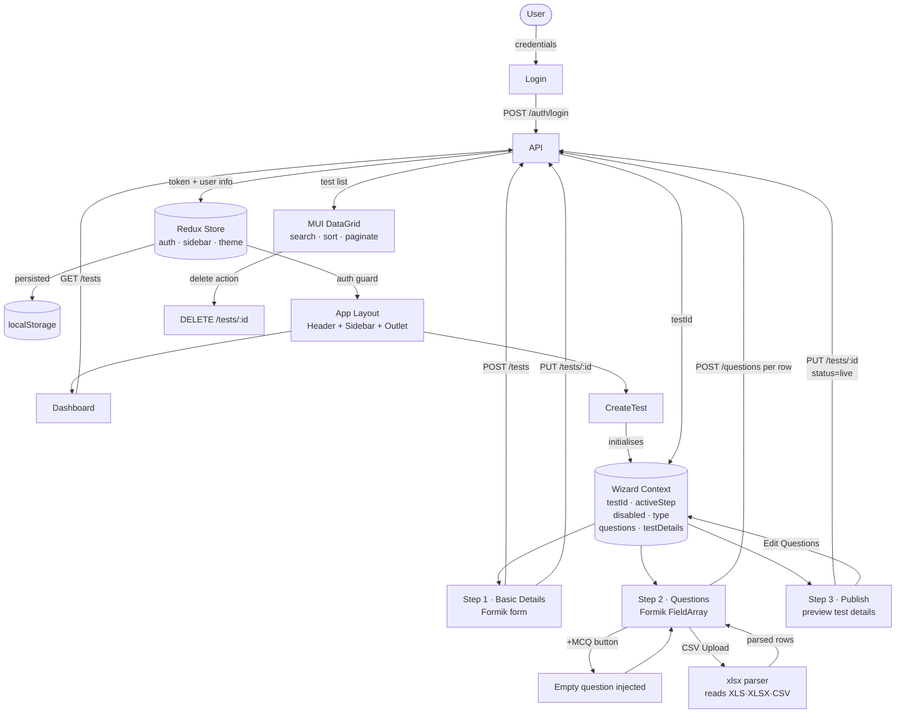

# PrepRoute — Admin Panel

Test creation and management panel for the PrepRoute platform.

## Prerequisites

- Node.js 20+ (or 22+)
- yarn

## Getting Started

### 1. Clone the repository

```bash
git clone <repo-url>
cd preproute
```

### 2. Install dependencies

```bash
yarn install
```

### 3. Set up environment variables

Create a `.env.local` file in the project root:

```env
VITE_API_BASE_URL=/api
VITE_API_TARGET=https://admin-moderator-backend-staging.up.railway.app
```

`VITE_API_TARGET` is the backend URL. The Vite dev server proxies all `/api/*` requests to this target, so no CORS issues locally.

### 4. Run the development server

```bash
yarn dev
```

App runs at [http://localhost:5173](http://localhost:5173)

### 5. Login credentials

```
Username: vedant-admin
Password: vedant123
```

## Build for Production

```bash
yarn build
```

Output goes to the `dist/` folder.

## Deployment

The app is deployed on **Vercel**. The `vercel.json` at the project root handles:
- Proxying `/api/*` requests to the Railway backend (avoids CORS)
- Catch-all rewrite to `index.html` for client-side routing

No environment variables need to be set in the Vercel dashboard — the proxy rewrite handles the backend URL directly.

## Architecture — Data Flow



---

## Tech Stack

| Layer | Library |
|---|---|
| Framework | React 19 + Vite 8 |
| UI | MUI v9, SCSS |
| State | Redux Toolkit + redux-persist |
| Forms | Formik + Yup |
| HTTP | Axios |
| Table | MUI X DataGrid |
| Rich text | React Quill |
| File parsing | xlsx |
